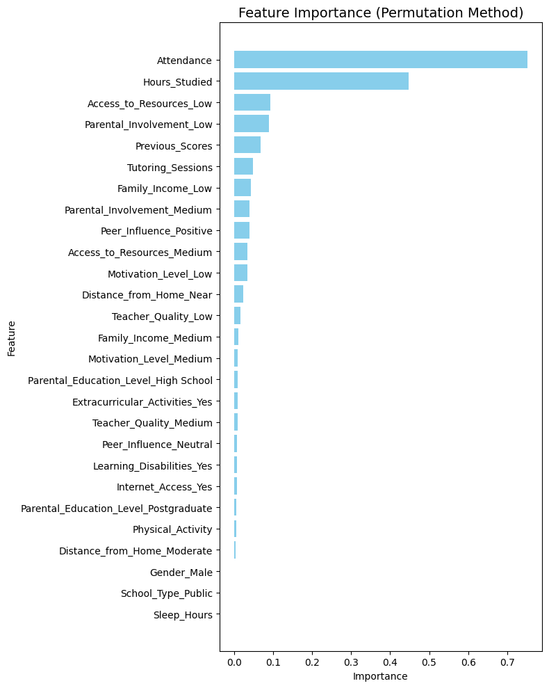

# Task 1: Student Score Prediction

## 📌 Description
This project uses the **Student Performance Factors** dataset from Kaggle to predict students' exam scores based on various academic, social, and lifestyle factors.  
The aim is to explore the most influential variables and build regression models to estimate the final score.

---

## 📊 Dataset
**Source**: [Kaggle - Student Performance Factors](https://www.kaggle.com/datasets/lainguyn123/student-performance-fact)  
**Target variable**: `Exam_Score`  
**Features**: Study hours, attendance, previous scores, parental involvement, sleep hours, etc.

---

## 🛠 Steps
1. **Data Cleaning**
   - Handled missing values.
   - Converted categorical variables to numeric using  encoding.

2. **Exploratory Data Analysis (EDA)**
   - Visualized distributions and correlations.
   - Identified key trends in study hours, attendance, and other factors.

3. **Model Building**
   - Split dataset into **80% training** and **20% testing**.
   - Scaled features using `StandardScaler`.
   - Trained:
     - **Linear Regression**
     - **Polynomial Regression (degree=2)**
     - **Linear Regression without `Sleep_Hours` and `Participation`**

4. **Evaluation Metrics**
   - **MAE** (Mean Absolute Error)  
   - **MSE** (Mean Squared Error)  
   - **R² Score** (Coefficient of Determination)

---

## 📈 Results

| Model | MAE | MSE | R² Score |
|-------|-----|-----|----------|
| Linear Regression | 0.450 | 3.26 | 0.770 |
| Polynomial Regression (deg=2) | 0.640 | 3.58 | 0.746 |
| Linear Regression (Without Sleep/Participation) | 0.449 | 3.25 | 0.770 |

💡 **Observation**: Removing `Sleep_Hours` and `Participation` had almost no effect on model performance. Polynomial regression slightly reduced accuracy.

---

## 🔍 Bonus - Feature Importance Analysis
Using **Permutation Importance**:
- **Most influential features**:  
  - Attendance (`0.75`)  
  - Hours_Studied (`0.45`)  
  - Access_to_Resources_Low, Parental_Involvement_Low (`≈ 0.09`)
  
- **Least influential features**:  
  - Sleep_Hours (`≈ 0.00`)  
  - Gender_Male (`≈ 0.00`)  
  - School_Type_Public (`≈ 0.00`)

✅ This confirms that sleep and participation have minimal predictive power for this dataset.

---

## 📊 Feature Importance Chart

---

## 🧰 Tools & Libraries
- Python  
- Pandas  
- Matplotlib  
- Scikit-learn
